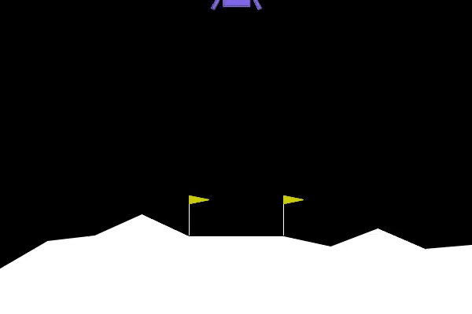
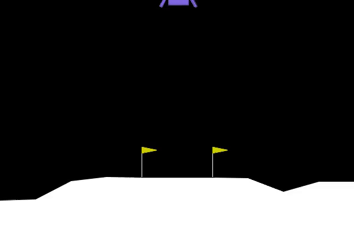
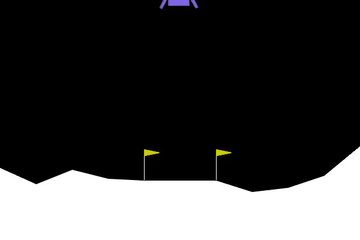

Q-Learning implementation in pytorch. You can find a simple q-learning agent in
the file `agent.py`

# Moon lander

The file `train_moon_lander.py` contains a script to train a QLearning agent to land
a space ship.

Before training:

After 500 episodes:

After 2000 episodes:

